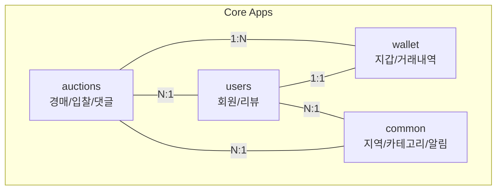

# [Overview] NeighborBid: 동네 기반 실시간 경매 플랫폼

> 이 문서는 A1_NeighborBid_Auction 프로젝트의 전체적인 개요와 핵심 기능, 기술 스택을 소개합니다.

---

## 1. 프로젝트 소개

### 1.1 비전 (Vision)

**"당근마켓의 동네 신뢰 + 실시간 경매의 스릴"**

NeighborBid는 지역 기반의 중고 거래와 실시간 경매를 결합한 새로운 형태의 커머스 플랫폼입니다. 기존 중고 거래 플랫폼의 "네고(흥정)" 문화 대신, 투명한 경쟁 입찰을 통해 판매자와 구매자 모두에게 공정한 가격을 제시합니다.

### 1.2 핵심 가치 (Core Values)

| 가치 | 설명 | 구현 방법 |
|:---:|---|---|
| **신뢰** | 금융 거래의 안전성 보장 | 이중 장부 시스템 (balance/locked_balance) |
| **공정** | 투명한 경쟁 입찰 | 실시간 가격 업데이트, 입찰 이력 공개 |
| **편의** | 동네 직거래의 접근성 | 지역 기반 필터링, 계층적 지역 구조 |
| **속도** | 마감 직전의 긴장감 | WebSocket 기반 실시간 통신 |

---

## 2. 핵심 기능 (Key Features)

### 2.1 하이브리드 경매 시스템

```
                    ┌─────────────────────────────────────┐
                    │         경매 등록 시 선택            │
                    └────────────────┬────────────────────┘
                                     │
                    ┌────────────────┴────────────────┐
                    ▼                                  ▼
         ┌──────────────────┐              ┌──────────────────┐
         │   동네 경매       │              │  전국 실시간 경매  │
         │ is_national=False│              │  is_national=True │
         ├──────────────────┤              ├──────────────────┤
         │ • HTTP 기반      │              │ • WebSocket 기반  │
         │ • DB 트랜잭션    │              │ • Redis Pub/Sub  │
         │ • 저비용 운영    │              │ • 실시간 브로드캐스트│
         │ • 중고 가구, 가전│              │ • 한정판, 인기상품 │
         └──────────────────┘              └──────────────────┘
```

### 2.2 안전한 거래 시스템

*   **지갑 시스템**: 충전식 가상 화폐를 통한 안전한 결제
*   **에스크로 패턴**: 입찰 시 금액을 잠금(lock)하여 이중 지출 방지
*   **자동 환불**: 상위 입찰 발생 시 이전 입찰자에게 자동 환불

### 2.3 지역 기반 서비스

*   **3단계 지역 구조**: 시/도 > 시/군/구 > 읍/면/동
*   **인접 지역 검색**: 같은 구 내 모든 동네의 경매 조회 가능
*   **전국 경매 옵션**: 지역 제한 없이 전국에 노출 가능

### 2.4 부가 기능

*   **즉시 구매**: 설정된 가격에 바로 구매 가능
*   **찜하기 (Watchlist)**: 관심 경매 저장
*   **문의 댓글**: 상품에 대한 질문 기능
*   **판매자 평판**: 리뷰 기반 신용도 시스템

---

## 3. 기술 스택 (Tech Stack)

### 3.1 백엔드

| 기술 | 버전 | 역할 |
|---|:---:|---|
| Python | 3.11 | 메인 프로그래밍 언어 |
| Django | 5.2.8 | 웹 프레임워크 (MTV 패턴) |
| Django Channels | 4.x | WebSocket 비동기 처리 |
| Daphne | 4.x | ASGI 서버 |
| Redis | Alpine | Channel Layer 백엔드 (Pub/Sub) |
| SQLite3 | 내장 | 개발/테스트용 데이터베이스 |

### 3.2 인프라

| 기술 | 역할 |
|---|---|
| Docker | 컨테이너 가상화 |
| Docker Compose | 멀티 컨테이너 구성 및 실행 |
| Redis Commander | Redis 모니터링 도구 |

### 3.3 프론트엔드

| 기술 | 역할 |
|---|---|
| Django Templates | 서버 사이드 렌더링 |
| Bootstrap 5 | CSS 프레임워크 |
| Vanilla JavaScript | WebSocket 클라이언트 |

---

## 4. 프로젝트 구조 (Project Structure)

```
A1_NeighborBid_Auction/
├── config/                 # Django 프로젝트 설정
│   ├── settings.py         # 전역 설정 (DB, Redis, Channels)
│   ├── asgi.py             # ASGI 애플리케이션 진입점
│   └── urls.py             # 메인 URL 라우팅
│
├── auctions/               # [핵심] 경매 앱
│   ├── models.py           # Auction, Bid, Comment 모델
│   ├── views.py            # HTTP 요청 처리
│   ├── services.py         # 비즈니스 로직 (place_bid, buy_now 등)
│   ├── consumers.py        # WebSocket 처리
│   └── templates/          # 경매 관련 템플릿
│
├── users/                  # 사용자 앱
│   ├── models.py           # User, Review 모델
│   └── views.py            # 회원가입, 로그인, 프로필
│
├── wallet/                 # 지갑 앱
│   └── models.py           # Wallet, Transaction 모델
│
├── common/                 # 공통 앱
│   └── models.py           # Region, Category, Notification 모델
│
├── docker-compose.yml      # 컨테이너 구성
├── Dockerfile              # 이미지 빌드 설정
└── requirements.txt        # Python 의존성
```

---

## 5. 앱 간 관계도 (App Dependencies)



---

## 6. 실행 방법 (Quick Start)

### 6.1 Docker Compose 사용 (권장)

```bash
# 1. 프로젝트 클론
git clone repository-url
cd A1_NeighborBid_Auction

# 2. 컨테이너 실행
docker-compose up --build

# 3. DB 마이그레이션 (다른 터미널에서)
docker-compose exec web python manage.py migrate
docker-compose exec web python manage.py createsuperuser

# 4. 접속
# 메인 서비스: http://localhost:8000
# (관리자용)Redis 모니터링: http://localhost:8081
```

### 6.2 로컬 환경 사용

```bash
# 1. 가상환경 생성 및 활성화
python -m venv venv
venv\Scripts\activate  # Windows

# 2. 의존성 설치
pip install -r requirements.txt

# 3. DB 마이그레이션
python manage.py migrate
python manage.py createsuperuser

# 4. 서버 실행
python manage.py runserver
```

>  로컬 환경에서 WebSocket 기능을 사용하려면 Redis 서버가 별도로 필요합니다.

---

## 7. 관련 문서 (Documentation Index)

| 문서 | 설명 |
|---|---|
| [02_CORE_LOGIC_ANALYSIS.md](02_CORE_LOGIC_ANALYSIS.md) | 하이브리드 아키텍처 및 동시성 제어 |
| [03_SOFTWARE_PATTERNS.md](03_SOFTWARE_PATTERNS.md) | 적용된 디자인 패턴 |
| [04_TRIALS_AND_ERRORS.md](04_TRIALS_AND_ERRORS.md) | 시행착오 및 문제 해결 |
| [05_TESTING_STRATEGY.md](05_TESTING_STRATEGY.md) | 테스트 전략 |
| [06_TECHNICAL_DEEP_DIVE.md](06_TECHNICAL_DEEP_DIVE.md) | 기술 심층 분석 |
| [07_INFRASTRUCTURE_AND_DEPLOYMENT.md](07_INFRASTRUCTURE_AND_DEPLOYMENT.md) | 인프라 및 배포 |
| [데이터베이스(설계과정).md](데이터베이스(설계과정).md) | DB 스키마 설계 |

---

> **작성자:** A1_NeighborBid_Auction 개발팀  
> **최종 수정:** 2026년 1월