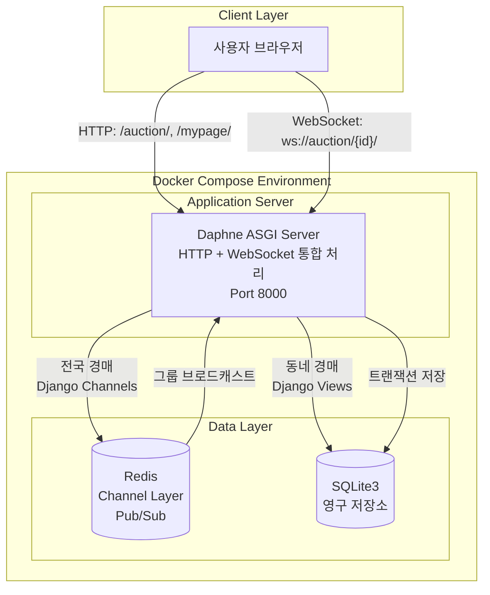

# [Core Logic] 0.1초의 승부, 하이브리드 아키텍처와 동시성 제어

> 이 문서는 A1_NeighborBid_Auction의 심장부인 **'경매 엔진'**의 작동 원리를 파헤칩니다. HTTP와 WebSocket을 병행하는 **하이브리드 아키텍처**와, 수천 건의 입찰 속에서 데이터 정합성을 지켜낸 **동시성 제어(Concurrency Control)** 로직을 상세히 설명합니다.

---

## 1. 하이브리드 아키텍처 (Hybrid Architecture)

### 1.1 도입 배경: 왜 하나의 프로토콜로는 부족한가?

초기 기획 단계에서 "모든 경매를 실시간으로 처리하자"는 의견이 있었습니다. 하지만 다음과 같은 현실적인 문제에 직면했습니다:

| 문제 상황 | 설명 |
|---|---|
| **과잉 인프라** | 하루에 1~2건 입찰되는 동네 중고 가구에 WebSocket + Redis를 붙이는 것은 비용 낭비 |
| **복잡성 증가** | 모든 기능을 비동기로 처리하면 디버깅과 유지보수가 어려움 |
| **사용자 기대** | 동네 직거래 사용자는 "실시간"보다 "신뢰와 편의"를 더 중시 |

**핵심 통찰:** 경매의 특성에 따라 통신 방식을 다르게 적용해야 한다.

### 1.2 의사결정: 프로토콜 선택 기준

저희는 `Auction.is_national` 플래그 하나로 두 가지 아키텍처를 유연하게 분기하기로 결정했습니다.

```python
# auctions/models.py
class Auction(models.Model):
    # True: WebSocket + Redis (전국 실시간 경매)
    # False: HTTP + DB 트랜잭션 (동네 경매)
    is_national = models.BooleanField(default=False, verbose_name="전국 실시간 경매")
```

| 구분 | 동네 경매 (`is_national=False`) | 전국 실시간 경매 (`is_national=True`) |
|:---:|:---:|:---:|
| **통신 방식** | HTTP Request-Response | WebSocket Persistent Connection |
| **인프라 의존** | SQLite3/PostgreSQL만 | + Redis (Channel Layer) |
| **실시간성** | 페이지 새로고침 필요 | 자동 실시간 업데이트 |
| **서버 리소스** | 요청 시에만 사용 | 연결 유지로 상시 점유 |
| **적합한 상품** | 중고 가구, 생활가전 | 한정판 신발, 콘서트 티켓 |
| **인프라 비용** |  (저렴) |  (Redis 필요) |

### 1.3 현재 아키텍처 구조도 (개발 환경)



> **현재 구성:** 개발 편의성을 위해 Daphne 단일 서버가 HTTP와 WebSocket을 모두 처리합니다.  
> **향후 계획:** 프로덕션 환경에서는 Nginx(리버스 프록시) + Gunicorn(HTTP) + Daphne(WebSocket) 분리 구성으로 확장 예정.

### 1.4 Track A: 동네 경매 (HTTP 기반)

**적용 대상:**
- 회원가입, 로그인, 로그아웃
- 지갑 충전, 거래 내역 조회
- **동네 경매 입찰** (`is_national=False`)
- 즉시 구매, 경매 종료

**실제 구현 예시:**

```python
# auctions/views.py - HTTP 입찰 처리
@login_required
def auction_detail(request, auction_id):
    auction = get_object_or_404(Auction, id=auction_id)
    
    if request.method == 'POST':
        # 판매자 본인은 입찰 불가
        if request.user == auction.seller:
            messages.error(request, "판매자는 본인의 경매에 입찰할 수 없습니다.")
            return redirect('auction_detail', auction_id=auction.id)
        
        amount = int(request.POST.get('amount'))
        try:
            # 서비스 레이어의 핵심 로직 호출
            msg = place_bid(auction.id, request.user, amount)
            messages.success(request, msg)
        except ValueError as e:
            messages.error(request, str(e))
            
        return redirect('auction_detail', auction_id=auction.id)
    
    return render(request, 'auctions/auction_detail.html', {'auction': auction})
```

**장점:**
- 트랜잭션 에러 처리가 명확함 (try-except로 깔끔하게 처리)
- 서버 리소스를 요청 시에만 사용
- Django의 성숙한 Form/View 시스템 활용 가능

### 1.5 Track B: 전국 실시간 경매 (WebSocket 기반)

**적용 대상:**
- **전국 경매 입찰** (`is_national=True`)
- 실시간 가격 업데이트 브로드캐스트
- 즉시 구매 알림 전파

**실제 구현 예시:**

```python
# auctions/consumers.py - WebSocket 입찰 처리
class AuctionConsumer(AsyncWebsocketConsumer):
    async def connect(self):
        self.auction_id = self.scope['url_route']['kwargs']['auction_id']
        self.room_group_name = f'auction_{self.auction_id}'
        
        # 경매 방(Group)에 참여
        await self.channel_layer.group_add(self.room_group_name, self.channel_name)
        await self.accept()

    async def receive(self, text_data):
        data = json.loads(text_data)
        
        if data.get('action') == 'bid':
            amount = int(data['amount'])
            user = self.scope['user']
            
            # DB 작업은 동기 함수를 비동기로 래핑
            result_msg = await self.save_bid(self.auction_id, user, amount)
            
            if "성공" in result_msg:
                # 같은 경매를 보고 있는 모든 사용자에게 실시간 전파
                await self.channel_layer.group_send(
                    self.room_group_name,
                    {
                        'type': 'auction_update',
                        'amount': amount,
                        'bidder': user.username,
                        'msg': result_msg
                    }
                )
            else:
                # 에러는 본인에게만 전송
                await self.send(text_data=json.dumps({'error': result_msg}))

    @database_sync_to_async
    def save_bid(self, auction_id, user, amount):
        try:
            # 동일한 place_bid 로직 재사용! (코드 중복 제거)
            return place_bid(auction_id, user, amount)
        except ValueError as e:
            return str(e)
```

**장점:**
- 클라이언트가 폴링할 필요 없이 서버가 직접 푸시
- ms 단위의 빠른 응답 (HTTP 헤더 오버헤드 없음)
- 동일한 `place_bid` 서비스 함수 재사용으로 코드 일관성 유지

---

## 2. 동시성 제어 (Concurrency Control) 상세 분석

### 2.1 문제 정의: 왜 동시성 제어가 필요한가?

경매 시스템에서 가장 치명적인 버그는 **이중 지출(Double Spending)**입니다.

**시나리오:**
```
시간 T=0: 사용자 A의 잔액 = 10,000원
시간 T=1: 경매 X에 10,000원 입찰 요청 → 잔액 체크 OK (10,000원 있음)
시간 T=1: 경매 Y에 10,000원 입찰 요청 → 잔액 체크 OK (아직 10,000원으로 보임!)
시간 T=2: 경매 X 입찰 성공 → 잔액 = 0원
시간 T=2: 경매 Y 입찰 성공 → 잔액 = -10,000원
```

이 문제가 발생하는 이유:
1. 두 요청이 **거의 동시에** 도착
2. 각 요청이 **같은 시점의 데이터**를 읽어감
3. 애플리케이션 레벨의 `if balance >= amount` 검사가 **순차적으로 실행되지 않음**

### 2.2 해결책: 비관적 락 (Pessimistic Lock)

경매는 "재고 1개" 시스템입니다. 낙찰자는 반드시 1명이어야 하며, 충돌 가능성이 높으므로 **비관적 락**을 선택했습니다.

```python
# auctions/services.py
from django.db import transaction

def place_bid(auction_id, user, amount):
    """
    입찰을 수행하는 핵심 함수 (트랜잭션 + Row Lock 적용)
    """
    with transaction.atomic():
        # ============================================
        # [1단계] Row Lock 획득 - 핵심!
        # ============================================
        # select_for_update(): 이 row를 잠그고, 트랜잭션 끝날 때까지 유지
        # 다른 트랜잭션은 여기서 대기(Blocking)
        auction = Auction.objects.select_for_update().get(id=auction_id)
        
        # 경매 상태 및 시간 검증
        if auction.status != 'ACTIVE':
            raise ValueError("진행 중인 경매가 아닙니다.")
        if auction.end_time < timezone.now():
            raise ValueError("이미 종료된 경매입니다.")
            
        # 최소 입찰가 검증
        min_bid = auction.current_price + auction.bid_unit
        if auction.current_price == 0:
            min_bid = auction.start_price
        if amount < min_bid:
            raise ValueError(f"최소 {min_bid}원 이상 입찰해야 합니다.")

        # ============================================
        # [2단계] 이전 최고 입찰자 환불 (잠금 해제)
        # ============================================
        if auction.current_price > 0:
            last_bid = auction.bids.order_by('-amount').first()
            if last_bid:
                prev_wallet = Wallet.objects.select_for_update().get(user=last_bid.bidder)
                prev_wallet.locked_balance -= last_bid.amount
                prev_wallet.balance += last_bid.amount
                prev_wallet.save()
                
                Transaction.objects.create(
                    wallet=prev_wallet,
                    amount=last_bid.amount,
                    transaction_type='BID_REFUND',
                    description=f"경매({auction.title}) 상위 입찰 발생으로 환불"
                )

        # ============================================
        # [3단계] 입찰자 지갑에서 금액 잠금
        # ============================================
        wallet = Wallet.objects.select_for_update().get(user=user)
        if wallet.balance < amount:
            raise ValueError("잔액이 부족합니다.")
        
        wallet.balance -= amount
        wallet.locked_balance += amount
        wallet.save()
        
        Transaction.objects.create(
            wallet=wallet,
            amount=-amount,
            transaction_type='BID_LOCK',
            description=f"경매({auction.title}) 입찰 예약금"
        )

        # ============================================
        # [4단계] 입찰 기록 생성 및 현재가 갱신
        # ============================================
        Bid.objects.create(auction=auction, bidder=user, amount=amount)
        auction.current_price = amount
        auction.save()

        return f"성공! {amount}원에 입찰했습니다."
        
        # ============================================
        # [Lock 해제] 
        # with 블록 종료 → commit() 호출 → Row Lock 자동 해제
        # ============================================
```

### 2.3 비관적 락 vs 낙관적 락: 왜 비관적 락을 선택했는가?

| 방식 | 동작 원리 | 장점 | 단점 | 적합한 경우 |
|:---:|---|---|---|---|
| **비관적 락** | 읽을 때 Lock 획득 | 충돌 시 확실한 순서 보장 | 대기 시간 발생 가능 | **충돌 빈도 높음** |
| 낙관적 락 | 쓸 때 버전 체크 | 대기 없이 빠름 | 충돌 시 재시도 필요 | 충돌 빈도 낮음 |

**경매 시스템에 비관적 락이 적합한 이유:**
1. **마감 직전 트래픽 폭주**: 종료 1분 전에 입찰이 집중되므로 충돌 확률이 높음
2. **재시도 불가능한 상황**: 낙관적 락의 재시도 중에 경매가 끝나버릴 수 있음
3. **금융 데이터의 정확성**: 한 번의 실패도 허용되지 않음

### 2.4 'Lock 범위' 설계 전략

무분별한 Lock은 성능 저하를 야기합니다. 저희는 **최소한의 범위**만 잠그는 전략을 취했습니다.

```python
# 잘못된 예: 전체 테이블을 Lock (성능 재앙)
# Auction.objects.select_for_update().all()  # 🔺하지말것

# 올바른 예: 필요한 Row만 Lock
auction = Auction.objects.select_for_update().get(id=auction_id)  # 🔹 해당 경매만
wallet = Wallet.objects.select_for_update().get(user=user)        # 🔹 해당 지갑만
```

---

## 3. 트랜잭션 커밋과 알림의 동기화

### 3.1 문제: 가짜 알림 (Phantom Notification)

즉시 구매 기능 테스트 중, 기이한 현상이 발생했습니다:
- 사용자가 "구매 성공" 알림을 받음
- 하지만 새로고침하면 상품이 여전히 "판매 중"

**원인 분석:**
```python
# 잘못된 코드 (Bug)
with transaction.atomic():
    # DB 작업...
    auction.status = 'ENDED'
    auction.save()
    
    # 알림 전송 (문제 지점!)
    channel_layer.group_send(...)  # 즉시 전송됨
    
    # 만약 여기서 예외 발생하면?
    some_validation()  #  Exception!
    # → 트랜잭션 롤백되지만, 알림은 이미 전송됨!
```

### 3.2 해결: `transaction.on_commit` 훅

Django의 `on_commit` 훅을 사용하여 **"커밋이 확정된 후에만 알림 전송"** 원칙을 적용했습니다.

```python
# auctions/services.py - buy_now 함수
def buy_now(auction_id, buyer):
    # 트랜잭션 밖에서 정의 (클로저로 변수 캡처)
    def send_sold_out_notification():
        channel_layer = get_channel_layer()
        async_to_sync(channel_layer.group_send)(
            f'auction_{auction_id}',
            {
                'type': 'auction_end_notification',
                'bidder': buyer.username,
                'amount': instant_price_val,
                'msg': f" {buyer.username}님이 즉시 구매했습니다!"
            }
        )

    with transaction.atomic():
        # ... (구매 로직, DB Lock, 자산 이동) ...
        
        auction.status = 'ENDED'
        auction.save()
        
        # [핵심] 트랜잭션 성공 시에만 실행 예약
        transaction.on_commit(send_sold_out_notification)
    
    return f"축하합니다! 즉시 구매 완료!"
```

**동작 원리:**
1. `on_commit`에 함수를 등록
2. `with` 블록이 **정상 종료**되면 → `commit()` 호출 → 등록된 함수 실행
3. 예외 발생으로 롤백되면 → 등록된 함수는 **실행되지 않음**

---

## 4. 웹소켓 그룹 관리 (Room Management)

### 4.1 그룹 구조

Redis Channel Layer를 활용한 Pub/Sub 구조는 채팅방과 유사합니다.

```
Redis Channel Layer
├── auction_1 (Group)
│   ├── channel_abc123 (User A)
│   ├── channel_def456 (User B)
│   └── channel_ghi789 (User C)
│
├── auction_2 (Group)
│   └── channel_jkl012 (User D)
│
└── auction_3 (Group)
    ├── channel_mno345 (User E)
    └── channel_pqr678 (User F)
```

### 4.2 생명주기 (Lifecycle)

| 이벤트 | 동작 | 코드 |
|---|---|---|
| **Join** | 경매 페이지 입장 시 그룹 추가 | `group_add('auction_1', channel_name)` |
| **Broadcast** | 입찰 발생 시 그룹 전체 전송 | `group_send('auction_1', message)` |
| **Leave** | 페이지 이탈 시 그룹 제거 | `group_discard('auction_1', channel_name)` |

```python
# auctions/consumers.py
class AuctionConsumer(AsyncWebsocketConsumer):
    async def connect(self):
        self.room_group_name = f'auction_{self.auction_id}'
        
        # 그룹 참여
        await self.channel_layer.group_add(
            self.room_group_name,
            self.channel_name
        )
        await self.accept()

    async def disconnect(self, close_code):
        # 그룹 탈퇴 (메모리 누수 방지)
        await self.channel_layer.group_discard(
            self.room_group_name,
            self.channel_name
        )
```

### 4.3 트래픽 격리의 장점

이 구조 덕분에:
- 경매 A의 입찰 내역이 경매 B를 보는 사용자에게 전달되지 않음
- 수만 개의 경매가 동시에 진행되어도 트래픽이 서로 격리됨
- 불필요한 메시지 수신이 없어 클라이언트 부하 최소화

---

## 5. 결론: 설계 철학

A1_NeighborBid의 핵심 로직은 **"화려한 신기술보다는 확실한 제어"** 에 초점을 맞추었습니다.

| 원칙 | 적용 방법 |
|---|---|
| **적재적소** | HTTP/WebSocket 하이브리드로 비용 효율화 |
| **데이터 무결성** | DB Lock으로 동시성 문제 원천 차단 |
| **신뢰 가능한 알림** | `on_commit` 훅으로 커밋 후 전파 |
| **확장 가능성** | 그룹 기반 Pub/Sub으로 트래픽 격리 |

> **작성자:** A1_NeighborBid_Auction 백엔드 개발팀  
> **관련 문서:** [03_SOFTWARE_PATTERNS.md](03_SOFTWARE_PATTERNS.md) | [06_TECHNICAL_DEEP_DIVE.md](06_TECHNICAL_DEEP_DIVE.md)