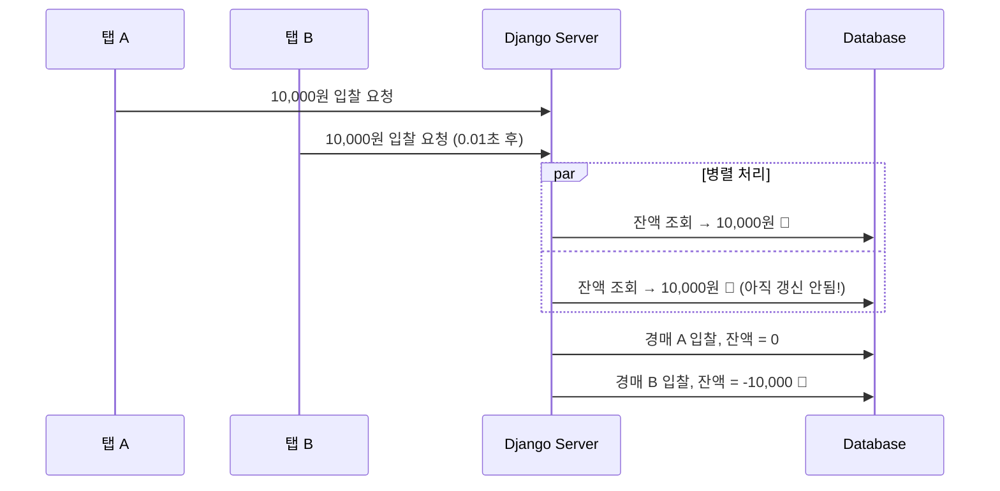

# [Retrospective] 시행착오와 문제 해결의 여정

> "처음부터 완벽한 코드는 없다."  
> 이 문서는 A1_NeighborBid_Auction 프로젝트를 개발하며 겪었던 주요 버그와 성능 이슈, 그리고 이를 극복하며 시스템을 고도화해 나간 **Problem-Solving 과정**을 가감 없이 기록합니다.

---

## 1. [Critical] 이중 지출(Double Spending) 버그🔺

### 1.1 현상 발견

테스트 중 발견한 치명적 버그:

```
테스트 시나리오:
1. 잔액 10,000원인 계정으로 로그인
2. 브라우저 탭 2개 열기 (경매 A, 경매 B)
3. 거의 동시에 두 탭에서 10,000원 입찰 버튼 클릭
4. 결과: 둘 다 성공! 잔액 = -10,000원 🔺
```

**심각도:** 🔺 Critical - 금융 무결성 훼손 (금액 차감이 중복 발생) 대형사고

### 1.2 원인 분석

전형적인 **Race Condition(경쟁 상태)** 문제였습니다.



**문제의 코드:**

```python
# 문제가 있던 초기 코드
def place_bid(auction_id, user, amount):
    wallet = Wallet.objects.get(user=user)  # 조회
    
    if wallet.balance < amount:  # 검증 (이 시점에 다른 요청도 통과!)
        raise ValueError("잔액 부족")
    
    wallet.balance -= amount  # 차감
    wallet.save()
```

### 1.3 해결 과정

#### 시도 1: Python threading.Lock 🔺

```python
import threading
lock = threading.Lock()

def place_bid(...):
    with lock:
        # 로직...
```

**실패 이유:** Gunicorn/Daphne는 **멀티 프로세스** 환경이라 각 프로세스가 별도의 메모리 공간을 사용. 프로세스 간 Lock 공유 불가.

#### 시도 2: 낙관적 락 (Optimistic Lock) 🔺

```python
# Wallet에 version 필드 추가
class Wallet(models.Model):
    version = models.IntegerField(default=0)

def place_bid(...):
    wallet = Wallet.objects.get(user=user)
    old_version = wallet.version
    
    # 저장 시 버전 체크
    updated = Wallet.objects.filter(
        user=user, 
        version=old_version
    ).update(
        balance=F('balance') - amount,
        version=F('version') + 1
    )
    
    if updated == 0:
        raise ValueError("다른 요청과 충돌! 재시도 필요")
```

**한계:** 
- 재시도(Retry) 로직 구현 복잡
- 마감 직전에는 재시도 중 경매 종료될 수 있음
- **충돌이 빈번한 경매** 에서는 성능 저하!! 🔺

#### 시도 3: 비관적 락 (Pessimistic Lock) 🔹최종 채택

```python
from django.db import transaction

def place_bid(auction_id, user, amount):
    with transaction.atomic():
        # DB 레벨에서 Row Lock - 다른 트랜잭션은 대기
        wallet = Wallet.objects.select_for_update().get(user=user)
        auction = Auction.objects.select_for_update().get(id=auction_id)
        
        if wallet.balance < amount:
            raise ValueError("잔액 부족")
        
        # 이제 안전하게 처리
        wallet.balance -= amount
        wallet.locked_balance += amount
        wallet.save()
```

**채택 이유:**
| 기준 | 낙관적 락 | 비관적 락 |
|---|:---:|:---:|
| 충돌 빈도 높을 때 | 🔺 재시도 비용 증가 | 🔹 순차 처리로 안정적 |
| 구현 복잡도 | 🔺 재시도 로직 필요 | 🔹 단순 |
| 마감 직전 트래픽 | 🔺 재시도 중 종료 위험 | 🔹 확실한 처리 |

### 1.4 검증

```python
# 동시성 테스트 코드
import threading

def test_double_spending():
    results = []
    
    def bid_request():
        try:
            place_bid(auction_id=1, user=test_user, amount=10000)
            results.append("success")
        except ValueError as e:
            results.append(f"fail: {e}")
    
    threads = [threading.Thread(target=bid_request) for _ in range(10)]
    for t in threads: t.start()
    for t in threads: t.join()
    
    # 성공은 1건만, 나머지는 "잔액 부족"
    assert results.count("success") == 1
```

**결과:** 이중 지출 발생 건수 **0건** 달성 🔹

---

## 2. [High] 가짜 알림(Phantom Notification) 버그 🔺

### 2.1 현상 발견

```
테스트 시나리오:
1. 사용자 A가 상품을 "즉시 구매" 버튼 클릭
2. "구매 성공!" 알림이 화면에 표시됨
3. 페이지 새로고침하니... 상품이 여전히 "판매 중" 
```

**심각도:** 🔺 High - 사용자 신뢰 훼손

### 2.2 원인 분석

```python
# 문제가 있던 코드
def buy_now(auction_id, buyer):
    with transaction.atomic():
        auction = Auction.objects.select_for_update().get(id=auction_id)
        
        # 구매 처리 로직
        
        auction.status = 'ENDED'
        auction.save()
        
        # 알림을 트랜잭션 안에서 전송!
        channel_layer = get_channel_layer()
        async_to_sync(channel_layer.group_send)(
            f'auction_{auction_id}',
            {'type': 'sold_out', 'msg': '구매 완료!'}
        )
        
        # 여기서 예외 발생하면?
        some_final_validation()  # Exception! → 롤백
        # 하지만 알림은 이미 전송됨!
```

**문제:** WebSocket 메시지 전송은 **롤백되지 않는 외부 시스템 호출**

### 2.3 해결: transaction.on_commit 적용

```python
# 수정된 코드
def buy_now(auction_id, buyer):
    # 트랜잭션 밖에서 함수 정의
    def send_notification():
        channel_layer = get_channel_layer()
        async_to_sync(channel_layer.group_send)(
            f'auction_{auction_id}',
            {'type': 'sold_out', 'msg': '구매 완료!'}
        )

    with transaction.atomic():
        auction = Auction.objects.select_for_update().get(id=auction_id)
        
        # ... 구매 처리 로직 ...
        
        auction.status = 'ENDED'
        auction.save()
        
        # 🔹🔹 트랜잭션 성공 시에만 실행 예약
        transaction.on_commit(send_notification)
    
    return "구매 완료"
```

**동작 원리:**

```
with transaction.atomic():
    │
    ├─ DB 작업 수행
    ├─ on_commit(함수) 등록
    │
    └─ 블록 종료
         │
         ├─ [성공 시] commit() → on_commit 함수 실행
         │
         └─ [실패 시] rollback() → on_commit 함수 무시
```

### 2.4 원칙 수립

> **"사이드 이펙트(이메일, 알림, 외부 API 호출)는  
> 반드시 DB 커밋이 확정된 후에 실행한다"**

이 원칙을 모든 비즈니스 로직에 적용하여 전수 검사 완료.

---

## 3. [Medium] 판매자 자기 입찰 버그 🔺

### 3.1 현상 발견

```
시나리오:
1. 판매자 A가 본인의 경매에 입찰
2. 입찰 성공 → 본인이 낙찰
3. 결과: 본인에게 돈을 보내게 됨 (무한 돈복사?)
```

**심각도:** 🔺 Medium - 비즈니스 로직 허점

### 3.2 원인

입찰 시 판매자 본인인지 확인하는 로직이 없었음.

### 3.3 해결

```python
# auctions/views.py
@login_required
def auction_detail(request, auction_id):
    auction = get_object_or_404(Auction, id=auction_id)
    
    if request.method == 'POST':
        # 🔹판매자 본인 체크 추가
        if request.user == auction.seller:
            messages.error(request, "판매자는 본인의 경매에 입찰할 수 없습니다.")
            return redirect('auction_detail', auction_id=auction.id)
        
        # ... 입찰 로직 ...
```

```python
# auctions/services.py - buy_now 함수에도 추가
def buy_now(auction_id, buyer):
    with transaction.atomic():
        auction = Auction.objects.select_for_update().get(id=auction_id)
        
        # 🔹판매자 본인 체크
        if buyer == auction.seller:
            raise ValueError("판매자는 자신의 물건을 구매할 수 없습니다.")
```

---

## 4. [Low] 지역 필터링 불완전🔺

### 4.1 현상 발견

```
시나리오:
1. "서울" 지역으로 필터링
2. 서울 > 강남구 > 역삼동 경매가 검색됨 🔹
3. 하지만 "강남구"로 필터링하면?
4. 역삼동, 삼성동 등 하위 동네가 안 나옴 🔺
```

### 4.2 원인

초기 구현에서는 직계 자식(depth 1)만 조회했음.

```python
# 문제가 있던 코드
def auction_list(request):
    region_id = request.GET.get('region')
    if region_id:
        selected_region = Region.objects.get(id=region_id)
        # 직계 자식만 포함
        regions_to_check = [selected_region] + list(selected_region.sub_regions.all())
        auctions = auctions.filter(region__in=regions_to_check)
```

### 4.3 해결: 재귀 함수로 모든 하위 지역 탐색

```python
# auctions/views.py

def get_all_descendants(region):
    """지역의 모든 하위 지역(자식, 손자, 증손자...)을 재귀적으로 찾기"""
    descendants = []
    children = region.sub_regions.all()
    for child in children:
        descendants.append(child)
        descendants.extend(get_all_descendants(child))  # 재귀 호출
    return descendants

def auction_list(request):
    region_id = request.GET.get('region')
    if region_id:
        selected_region = Region.objects.get(id=region_id)
        
        # 🔹 모든 하위 지역 포함
        regions_to_check = [selected_region] + get_all_descendants(selected_region)
        
        # 전국 경매도 함께 표시
        auctions = auctions.filter(
            Q(region__in=regions_to_check) | Q(is_national=True)
        )
```

---

## 5. 시행착오에서 얻은 교훈

### 5.1 문서화한 패턴

| 문제 유형 | 해결 패턴 | 적용 위치 |
|---|---|---|
| 동시성 이슈 | `select_for_update` | services.py |
| 외부 시스템 호출 | `transaction.on_commit` | services.py |
| 비즈니스 룰 검증 | View 진입점에서 체크 | views.py, services.py |
| 계층 데이터 조회 | 재귀 함수 | views.py |

### 5.2 개발 프로세스 개선

1. **코드 리뷰 체크리스트에 추가:**
   - [ ] 동시성 고려했는가? (Lock 필요?)
   - [ ] 외부 호출은 on_commit 안에 있는가?
   - [ ] 본인/권한 체크는 했는가?

2. **테스트 시나리오 확장:**
   - 단순 성공 케이스뿐 아니라 "동시에", "악의적으로" 시나리오 추가

3. **디버깅 로그 추가:**
   ```python
   print(f" [Debug] 즉시 구매 알림 전송 시작: Auction ID {auction_id}")
   ```

---

## 6. 마치며

이러한 시행착오들은 프로젝트를 더욱 견고하게 만들었습니다.  
단순히 "기능이 돌아간다"에 만족하지 않고, **극한의 상황**(동시성, 네트워크 지연, 악의적 사용)을 가정하고 테스트하며 얻은 경험은 코드 한 줄 한 줄에 깊이를 더해주었습니다.

> **"버그는 창피한 것이 아니라, 배움의 기회다."**

> **작성자:** A1_NeighborBid_Auction 백엔드 개발팀  
> **관련 문서:** [05_TESTING_STRATEGY.md](05_TESTING_STRATEGY.md)

