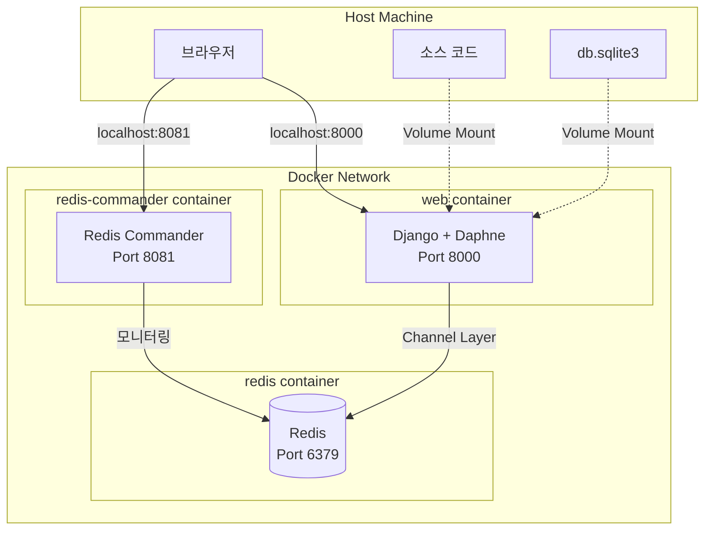
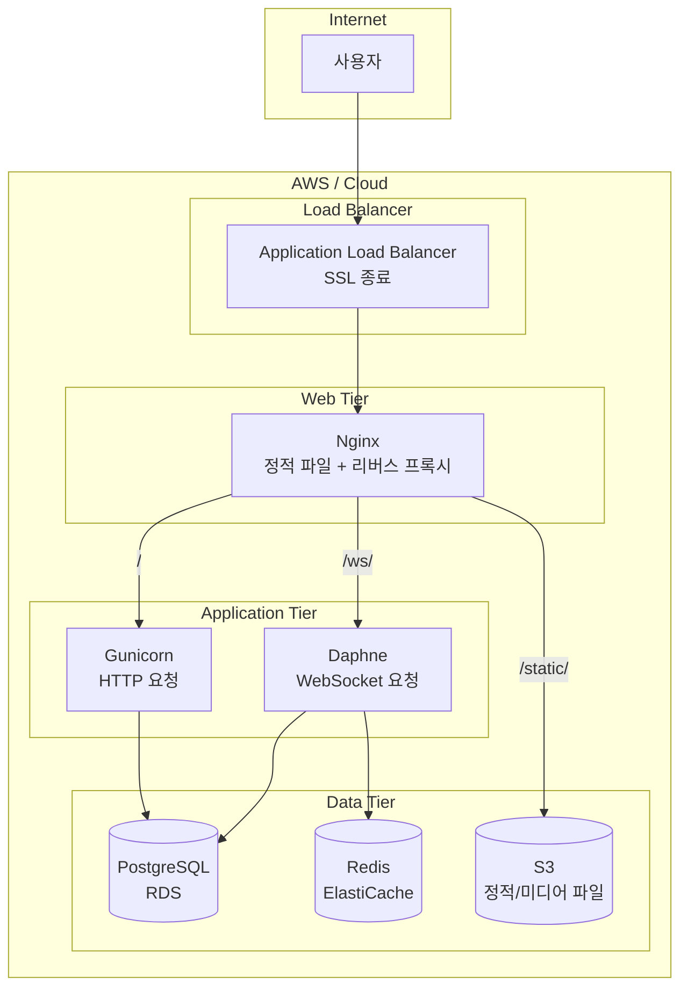

# [Infrastructure] Docker Compose를 활용한 개발 환경 구성 및 배포 전략

> 서비스 로직이 아무리 완벽해도 인프라가 불안정하면 무용지물입니다. 이 문서는 A1_NeighborBid_Auction의 **컨테이너 기반 개발 환경**과 향후 **프로덕션 배포 전략**을 설명합니다.

---

## 1. 인프라 철학: "개발 환경 = 프로덕션 환경"

### 1.1 Docker를 선택한 이유

| 문제 | Docker 해결책 |
|---|---|
| "내 PC에서는 되는데..." | 컨테이너로 환경 통일 |
| Python 버전 충돌 | 격리된 런타임 |
| Redis 설치 귀찮음 | 한 줄로 실행 |
| 팀원별 설정 차이 | docker-compose.yml 공유 |

### 1.2 현재 구성 개요

```
A1_NeighborBid_Auction/
├── docker-compose.yml    # 전체 서비스 오케스트레이션
├── Dockerfile            # Django 앱 이미지 정의
├── requirements.txt      # Python 의존성
└── db.sqlite3            # 개발용 DB (Volume 마운트)
```

---

## 2. Docker Compose 구성 상세

### 2.1 전체 구조도 (현재)



### 2.2 docker-compose.yml 분석

```yaml
version: '3.8'

services:
  # ┌────────────────────────────────────────────────────────────┐
  # │  [1] Redis - 메시지 브로커                                  │
  # └────────────────────────────────────────────────────────────┘
  redis:
    image: redis:alpine        # 경량 Alpine Linux 기반
    ports:
      - "6379:6379"            # 호스트에서도 접근 가능 (디버깅용)
    # 데이터 영속성 설정 없음 (인메모리 모드)
    # 경매 세션 데이터는 휘발되어도 DB에 저장되어 있음

  # ┌────────────────────────────────────────────────────────────┐
  # │  [2] Django Web - 메인 애플리케이션                         │
  # └────────────────────────────────────────────────────────────┘
  web:
    build: .                   # Dockerfile 기반 빌드
    command: python manage.py runserver 0.0.0.0:8000
    volumes:
      - .:/app                 # 소스 코드 마운트 (Hot Reload)
    ports:
      - "8000:8000"
    depends_on:
      - redis                  # Redis가 먼저 시작되어야 함
    environment:
      - REDIS_HOST=redis       # 컨테이너 네트워크에서 서비스명으로 접근

  # ┌────────────────────────────────────────────────────────────┐
  # │  [3] Redis Commander - Redis 관리 UI                       │
  # └────────────────────────────────────────────────────────────┘
  redis-commander:
    image: rediscommander/redis-commander:latest
    environment:
      - REDIS_HOSTS=local:redis:6379
    ports:
      - "8081:8081"
    depends_on:
      - redis
```

### 2.3 Dockerfile 분석

```dockerfile
# 1. 베이스 이미지: Python 3.11 (경량 버전)
FROM python:3.11-slim

# 2. 환경 변수: 로그 버퍼링 비활성화 (실시간 로그 출력)
ENV PYTHONUNBUFFERED=1

# 3. 작업 디렉토리 설정
WORKDIR /app

# 4. 의존성 먼저 설치 (캐시 레이어 활용)
#    requirements.txt가 변경되지 않으면 재설치 스킵
COPY requirements.txt /app/
RUN pip install --no-cache-dir -r requirements.txt

# 5. 소스 코드 복사
COPY . /app/

# 6. 포트 노출
EXPOSE 8000

# 7. 기본 실행 명령
#    docker-compose.yml의 command가 이를 오버라이드
CMD ["python", "manage.py", "runserver", "0.0.0.0:8000"]
```

---

## 3. 개발 환경 실행 가이드

### 3.1 기본 명령어

```bash
# 서비스 시작 (백그라운드)
docker-compose up -d

# 로그 확인
docker-compose logs -f web

# 서비스 중지
docker-compose down

# 이미지 재빌드 (requirements.txt 변경 시)
docker-compose up --build
```

### 3.2 Django 관리 명령

```bash
# 마이그레이션
docker-compose exec web python manage.py migrate

# 슈퍼유저 생성
docker-compose exec web python manage.py createsuperuser

# 셸 접속
docker-compose exec web python manage.py shell

# 테스트 실행
docker-compose exec web python manage.py test
```

### 3.3 접속 주소

| 서비스 | URL | 용도 |
|---|---|---|
| 메인 애플리케이션 | http://localhost:8000 | 경매 서비스 |
| 관리자 페이지 | http://localhost:8000/admin | Django Admin |
| Redis Commander | http://localhost:8081 | Redis 모니터링 |

---

## 4. Volume 마운트 전략

### 4.1 소스 코드 마운트

```yaml
volumes:
  - .:/app  # 현재 디렉토리 전체를 /app에 마운트
```

**장점:**
- 코드 수정 시 자동 반영 (Django runserver의 자동 재시작)
- 이미지 재빌드 없이 개발 가능

**주의:**
- `.dockerignore`에 불필요한 파일 제외 권장
- `venv/`, `__pycache__/`, `.git/` 등

### 4.2 데이터베이스 전략

**현재:** SQLite3 파일이 소스 코드와 함께 마운트됨

```
호스트: ./db.sqlite3
   (자동 동기화)
컨테이너: /app/db.sqlite3
```

**장점:**
- 컨테이너 재시작해도 데이터 유지
- 호스트에서 직접 DB 파일 백업 가능

---

## 5. 네트워크 구성

### 5.1 Docker 내부 네트워크

```
docker-compose가 생성하는 기본 네트워크:
a1_neighborbid_auction_default

┌─────────────────────────────────────────────────┐
│  Docker Network                                 │
│                                                 │
│  web ──────────────────────────────► redis      │
│       서비스명으로 접근: "redis:6379"            │
│                                                 │
│  redis-commander ───────────────────► redis     │
│                                                 │
└─────────────────────────────────────────────────┘
```

### 5.2 Django 설정에서의 연결

```python
# config/settings.py
CHANNEL_LAYERS = {
    "default": {
        "BACKEND": "channels_redis.core.RedisChannelLayer",
        "CONFIG": {
            # "redis"는 docker-compose의 서비스 이름
            # Docker 내부 DNS가 자동으로 IP 해석
            "hosts": [("redis", 6379)],
        },
    },
}
```

---

## 6. 프로덕션 배포 전략 (향후 계획)

### 6.1 현재 vs 프로덕션 비교

| 항목 | 현재 (개발) | 프로덕션 (계획) |
|---|---|---|
| 웹 서버 | runserver | Nginx + Gunicorn + Daphne |
| 데이터베이스 | SQLite3 | PostgreSQL (RDS) |
| 정적 파일 | Django 서빙 | Nginx 또는 S3 |
| SSL | 없음 | Let's Encrypt 또는 ACM |
| 환경 변수 | 하드코딩 | .env 파일 또는 Secrets Manager |

### 6.2 프로덕션 아키텍처 (계획)



### 6.3 프로덕션 docker-compose.yml (예시)

```yaml
version: '3.8'

services:
  nginx:
    image: nginx:alpine
    ports:
      - "80:80"
      - "443:443"
    volumes:
      - ./nginx.conf:/etc/nginx/nginx.conf:ro
      - ./static:/app/static:ro
      - ./certbot/conf:/etc/letsencrypt:ro
    depends_on:
      - gunicorn
      - daphne

  gunicorn:
    build: .
    command: gunicorn config.wsgi:application --bind 0.0.0.0:8000 --workers 4
    volumes:
      - .:/app
    expose:
      - "8000"
    environment:
      - DJANGO_SETTINGS_MODULE=config.settings.production
      - DATABASE_URL=${DATABASE_URL}
      - REDIS_URL=${REDIS_URL}
    depends_on:
      - redis

  daphne:
    build: .
    command: daphne -b 0.0.0.0 -p 8001 config.asgi:application
    volumes:
      - .:/app
    expose:
      - "8001"
    environment:
      - DJANGO_SETTINGS_MODULE=config.settings.production
      - DATABASE_URL=${DATABASE_URL}
      - REDIS_URL=${REDIS_URL}
    depends_on:
      - redis

  redis:
    image: redis:alpine
    # 프로덕션에서는 ElastiCache로 대체 권장
```

### 6.4 Nginx 설정 예시

```nginx
# nginx.conf

upstream django_http {
    server gunicorn:8000;
}

upstream django_websocket {
    server daphne:8001;
}

server {
    listen 80;
    server_name neighborbid.com;

    # 정적 파일 직접 서빙
    location /static/ {
        alias /app/static/;
        expires 30d;
        add_header Cache-Control "public, immutable";
    }

    # 미디어 파일
    location /media/ {
        alias /app/media/;
    }

    # WebSocket 요청
    location /ws/ {
        proxy_pass http://django_websocket;
        proxy_http_version 1.1;
        proxy_set_header Upgrade $http_upgrade;
        proxy_set_header Connection "upgrade";
        proxy_set_header Host $host;
        proxy_set_header X-Real-IP $remote_addr;
    }

    # 일반 HTTP 요청
    location / {
        proxy_pass http://django_http;
        proxy_set_header Host $host;
        proxy_set_header X-Real-IP $remote_addr;
        proxy_set_header X-Forwarded-For $proxy_add_x_forwarded_for;
        proxy_set_header X-Forwarded-Proto $scheme;
    }
}
```

---

## 7. 환경 변수 관리

### 7.1 현재 (개발)

```python
# config/settings.py - 하드코딩 (개발용)
SECRET_KEY = 'django-insecure-...'
DEBUG = True
```

### 7.2 프로덕션 권장

```python
# config/settings/production.py
import os

SECRET_KEY = os.environ.get('SECRET_KEY')
DEBUG = False
ALLOWED_HOSTS = os.environ.get('ALLOWED_HOSTS', '').split(',')

DATABASES = {
    'default': {
        'ENGINE': 'django.db.backends.postgresql',
        'NAME': os.environ.get('DB_NAME'),
        'USER': os.environ.get('DB_USER'),
        'PASSWORD': os.environ.get('DB_PASSWORD'),
        'HOST': os.environ.get('DB_HOST'),
        'PORT': os.environ.get('DB_PORT', '5432'),
    }
}
```

```bash
# .env 파일 (Git에 포함하지 않음!)
SECRET_KEY=your-super-secret-key-here
DB_NAME=neighborbid
DB_USER=postgres
DB_PASSWORD=secure-password
DB_HOST=db.example.com
REDIS_URL=redis://cache.example.com:6379
```

---

## 8. CI/CD 파이프라인 (향후 계획)

### 8.1 GitHub Actions 예시

```yaml
# .github/workflows/deploy.yml
name: Deploy to Production

on:
  push:
    branches: [main]

jobs:
  test:
    runs-on: ubuntu-latest
    steps:
      - uses: actions/checkout@v3
      - name: Run Tests
        run: |
          docker-compose -f docker-compose.test.yml up --build --abort-on-container-exit

  deploy:
    needs: test
    runs-on: ubuntu-latest
    steps:
      - name: Deploy to Server
        run: |
          ssh user@server "cd /app && git pull && docker-compose up --build -d"
```

---

## 9. 결론

### 9.1 현재 달성한 것

| 항목 | 상태 |
|---|:---:|
| Docker 기반 개발 환경 | 🔹 |
| Redis + Django Channels 통합 | 🔹 |
| Hot Reload 개발 환경 | 🔹 |
| 데이터 영속성 (SQLite Volume) | 🔹 |

### 9.2 향후 로드맵

| 항목 | 예상 시기 |
|---|---|
| PostgreSQL 마이그레이션 | 베타 전 |
| 환경 변수 분리 (.env) | 베타 전 |
| Nginx + Gunicorn/Daphne 분리 | 정식 출시 전 |
| AWS 배포 (EC2/ECS) | 정식 출시 전 |
| CI/CD 파이프라인 | 정식 출시 후 |
| 모니터링 (CloudWatch, Sentry) | 운영 안정화 후 |

코드가 소프트웨어의 영혼이라면, 인프라는 육체라고 생각합니다.
Docker 기반의 표준화된 환경 구축을 통해 **"내 PC에서는 되는데 서버에서는 안 돼요"** 라는 고질적인 문제를 원천 차단했습니다.

> **작성자:** A1_NeighborBid_Auction 개발팀  
> **관련 문서:** [06_TECHNICAL_DEEP_DIVE.md](06_TECHNICAL_DEEP_DIVE.md) | [01_PROJECT_OVERVIEW.md](01_PROJECT_OVERVIEW.md)