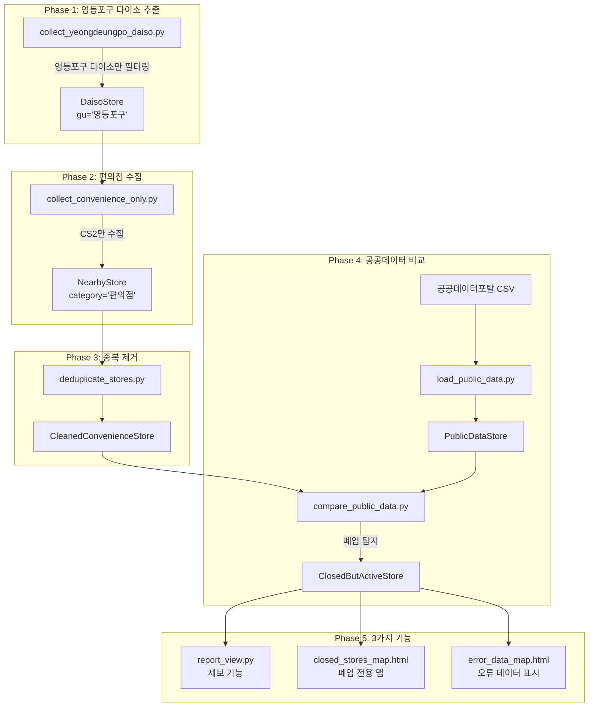

# 🏪 영등포구 다이소 편의점 폐업 탐지 시스템 설계서

> **목표**: 영등포구 다이소 주변 편의점 데이터 수집 및 공공데이터 기반 폐업 매장 탐지  
> **분석 대상**: Django 5.x + GeoDjango + 카카오 API + 공공데이터포탈  
> **핵심 기능**: 폐업 매장 제보, 폐업 매장 전용 맵, 데이터 오류 시각화

---

## 📋 목차

| 번호 | 항목 | 상태 |
|:---:|------|:---:|
| 1 | [프로젝트 개요](#1-프로젝트-개요) | 📋 |
| 2 | [Phase 1: 영등포구 다이소 추출](#2-phase-1-영등포구-다이소-추출) | ⬜ |
| 3 | [Phase 2: 편의점 데이터 수집](#3-phase-2-편의점-데이터-수집) | ⬜ |
| 4 | [Phase 3: 중복 제거](#4-phase-3-중복-제거) | ⬜ |
| 5 | [Phase 4: 공공데이터 비교](#5-phase-4-공공데이터-비교) | ⬜ |
| 6 | [Phase 5: 폐업 매장 DB 생성](#6-phase-5-폐업-매장-db-생성) | ⬜ |
| 7 | [Phase 6: 3가지 기능 구현](#7-phase-6-3가지-기능-구현) | ⬜ |
| 8 | [검증 계획](#8-검증-계획) | 📋 |

### 상태 범례
- ⬜ 미착수
- 🔄 진행 중
- ✅ 완료
- 📋 계획

---

## 1. 프로젝트 개요

### 1.1 현재 시스템 분석


현재 프로젝트는 다음과 같은 흐름으로 동작합니다:

| 파일 | 역할 |
|------|------|
| [collect_daiso.py](file:///c:/A3_radius_collector-Public/stores/management/commands/collect_daiso.py) | 서울 25개 구별 "서울 {구} 다이소" 키워드로 다이소 지점 수집 |
| [collect_nearby_stores.py](file:///c:/A3_radius_collector-Public/stores/management/commands/collect_nearby_stores.py) | 수집된 다이소 기준 반경 1km 내 카페(CE7) + 편의점(CS2) 수집 |
| [models.py](file:///c:/A3_radius_collector-Public/stores/models.py) | `DaisoStore`, `NearbyStore` 모델 정의 |
| [views.py](file:///c:/A3_radius_collector-Public/stores/views.py) | 카카오맵 시각화 뷰 |

### 1.2 확장 프로젝트 아키텍처



---

## 2. Phase 1: 영등포구 다이소 추출

### 📌 목표
- 기존 25개 구 전체 수집 대신, **영등포구 다이소만** 추출
- 주소 검증을 통해 정확한 영등포구 데이터만 저장

### 🏗️ 구현 방향

#### [NEW] [collect_yeongdeungpo_daiso.py](file:///c:/A3_radius_collector-Public/stores/management/commands/collect_yeongdeungpo_daiso.py)

```python
# stores/management/commands/collect_yeongdeungpo_daiso.py

import requests
import time
from django.core.management.base import BaseCommand
from django.contrib.gis.geos import Point
from stores.models import YeongdeungpoDaiso  # 영등포구 전용 모델 사용

class Command(BaseCommand):
    help = '영등포구 내 다이소 지점만 수집합니다.'

    def is_yeongdeungpo_address(self, address):
        """주소가 영등포구인지 확인"""
        if not address:
            return False
        return '영등포구' in address or '영등포' in address

    def handle(self, *args, **options):
        KAKAO_API_KEY = ''  # 본인의 API KEY 입력
        headers = {"Authorization": f"KakaoAK {KAKAO_API_KEY}"}
        
        url = "https://dapi.kakao.com/v2/local/search/keyword.json"
        query = "서울 영등포구 다이소"
        
        self.stdout.write(self.style.WARNING(f"--- 검색 시작: {query} ---"))
        
        collected_count = 0
        page = 1
        
        while True:
            params = {
                "query": query,
                "page": page,
                "size": 15,
            }
            
            try:
                response = requests.get(url, headers=headers, params=params, timeout=5)
                response.raise_for_status()
            except requests.exceptions.RequestException as e:
                self.stdout.write(self.style.ERROR(f"네트워크 오류: {e}"))
                break
            
            data = response.json()
            documents = data.get('documents', [])
            meta = data.get('meta', {})
            
            if not documents:
                break
            
            for item in documents:
                if '다이소' not in item.get('place_name', ''):
                    continue
                
                address = item.get('address_name') or item.get('road_address_name')
                
                # [핵심] 영등포구 주소 검증
                if not self.is_yeongdeungpo_address(address):
                    self.stdout.write(f"  ⚠️ 영등포구 아님, 스킵: {item.get('place_name')} ({address})")
                    continue
                
                try:
                    lng = float(item.get('x'))
                    lat = float(item.get('y'))
                    point = Point(lng, lat)
                except (ValueError, TypeError):
                    continue
                
                store, created = YeongdeungpoDaiso.objects.update_or_create(
                    daiso_id=item.get('id'),
                    defaults={
                        'name': item.get('place_name'),
                        'address': address,
                        'location': point,
                    }
                )
                
                action = "생성" if created else "업데이트"
                self.stdout.write(f"  ✅ {item.get('place_name')} - {action}")
                collected_count += 1
            
            if meta.get('is_end'):
                break
            
            page += 1
            time.sleep(0.5)
        
        self.stdout.write(self.style.SUCCESS(f"총 {collected_count}개의 영등포구 다이소 수집 완료"))
```

> [!IMPORTANT]
> **영등포구 전용 테이블 사용**
> - `YeongdeungpoDaiso` 모델 (테이블명: `yeongdeungpo_daiso`)
> - 서울 전체 `DaisoStore`와 분리되어 저장됨

---

## 3. Phase 2: 편의점 데이터 수집

### 📌 목표
- 영등포구 다이소 각 지점 기준 **편의점(CS2)만** 수집
- 카페(CE7) 제외

### 🏗️ 구현 방향

#### [NEW] [collect_convenience_only.py](file:///c:/A3_radius_collector-Public/stores/management/commands/collect_convenience_only.py)

```python
# stores/management/commands/collect_convenience_only.py

import requests
import time
from django.core.management.base import BaseCommand
from django.contrib.gis.geos import Point
from stores.models import YeongdeungpoDaiso, YeongdeungpoConvenience  # 영등포구 전용 모델

class Command(BaseCommand):
    help = '영등포구 다이소 기준 편의점만 수집합니다. (카페 제외)'

    def handle(self, *args, **options):
        KAKAO_API_KEY = ''  # 본인의 API KEY 입력
        headers = {"Authorization": f"KakaoAK {KAKAO_API_KEY}"}
        
        # [핵심] 편의점만 수집
        TARGET_CATEGORIES = ['CS2']  # CS2: 편의점만!
        
        # 영등포구 다이소 전체 조회 (이미 영등포구만 저장됨)
        daiso_list = YeongdeungpoDaiso.objects.all()
        total_daiso_count = daiso_list.count()
        
        if total_daiso_count == 0:
            self.stdout.write(self.style.ERROR("영등포구 다이소가 없습니다. 먼저 collect_yeongdeungpo_daiso를 실행하세요."))
            return
        
        self.stdout.write(self.style.SUCCESS(f"총 {total_daiso_count}개의 영등포구 다이소에 대해 편의점 수집을 시작합니다."))

        DELTA_LAT = 0.0090  
        DELTA_LNG = 0.0113 

        total_collected = 0

        for idx, daiso in enumerate(daiso_list, 1):
            if not daiso.location:
                continue

            cx = daiso.location.x
            cy = daiso.location.y

            self.stdout.write(f"[{idx}/{total_daiso_count}] '{daiso.name}' 주변 편의점 탐색 중...")

            quadrants = [
                f"{cx:.6f},{cy:.6f},{(cx + DELTA_LNG):.6f},{(cy + DELTA_LAT):.6f}",
                f"{(cx - DELTA_LNG):.6f},{cy:.6f},{cx:.6f},{(cy + DELTA_LAT):.6f}",
                f"{(cx - DELTA_LNG):.6f},{(cy - DELTA_LAT):.6f},{cx:.6f},{cy:.6f}",
                f"{cx:.6f},{(cy - DELTA_LAT):.6f},{(cx + DELTA_LNG):.6f},{cy:.6f}"
            ]

            stored_count = 0

            for category_code in TARGET_CATEGORIES:
                for rect in quadrants:
                    url = "https://dapi.kakao.com/v2/local/search/category.json"
                    page = 1
                    
                    while True:
                        params = {
                            "category_group_code": category_code,
                            "rect": rect,
                            "x": f"{cx:.6f}",
                            "y": f"{cy:.6f}",
                            "page": page,
                            "size": 15,
                            "sort": "distance"
                        }

                        try:
                            response = requests.get(url, headers=headers, params=params, timeout=5)
                            response.raise_for_status()
                            data = response.json()
                        except Exception as e:
                            self.stdout.write(self.style.ERROR(f"API 요청 실패: {e}"))
                            break

                        documents = data.get('documents', [])
                        
                        if not documents:
                            break

                        for item in documents:
                            try:
                                lng = float(item.get('x'))
                                lat = float(item.get('y'))
                                point = Point(lng, lat)
                                dist = int(item.get('distance', 0))
                                
                                NearbyStore.objects.update_or_create(
                                    place_id=item.get('id'),
                                    defaults={
                                        'name': item.get('place_name'),
                                        'address': item.get('road_address_name') or item.get('address_name'),
                                        'phone': item.get('phone'),
                                        'category': '편의점',  # 명시적으로 '편의점'으로 저장
                                        'location': point,
                                        'distance': dist,
                                        'base_daiso': daiso.name
                                    }
                                )
                                stored_count += 1
                            except Exception as e:
                                continue

                        if data.get('meta', {}).get('is_end'):
                            break
                        
                        page += 1
                        if page > 3:
                            break
                        
                        time.sleep(0.2)

            self.stdout.write(f"  -> {stored_count}개 편의점 저장")
            total_collected += stored_count
            time.sleep(0.3)

        self.stdout.write(self.style.SUCCESS(f"총 {total_collected}개의 편의점 데이터 수집 완료"))
```

---

## 4. Phase 3: 중복 제거

### 📌 목표
- 영등포구 다이소 여러 지점에서 중복으로 수집된 편의점 데이터 정리
- `place_id` 기준 고유 편의점만 유지

### 🏗️ 모델 추가

#### [MODIFY] [models.py](file:///c:/A3_radius_collector-Public/stores/models.py)

```python
# 기존 모델 유지, 아래 모델 추가

class CleanedConvenienceStore(models.Model):
    """중복 제거된 영등포구 편의점 데이터"""
    place_id = models.CharField(max_length=50, unique=True)
    name = models.CharField(max_length=100)
    address = models.CharField(max_length=200)
    phone = models.CharField(max_length=50, null=True, blank=True)
    location = gis_models.PointField(srid=4326)
    
    # 어떤 다이소들에서 발견되었는지 쉼표로 구분
    discovered_from_daisos = models.TextField(default='')
    first_discovered_at = models.DateTimeField(auto_now_add=True)
    
    class Meta:
        db_table = 'cleaned_convenience_stores'
    
    def __str__(self):
        return f"{self.name} ({self.address})"
```

#### [NEW] [deduplicate_stores.py](file:///c:/A3_radius_collector-Public/stores/management/commands/deduplicate_stores.py)

```python
# stores/management/commands/deduplicate_stores.py

from django.core.management.base import BaseCommand
from stores.models import NearbyStore, CleanedConvenienceStore

class Command(BaseCommand):
    help = '영등포구 다이소 주변 편의점 데이터 중복 제거'

    def handle(self, *args, **options):
        # 편의점 데이터만 대상
        convenience_stores = NearbyStore.objects.filter(category='편의점')
        
        self.stdout.write(f"총 {convenience_stores.count()}개의 편의점 데이터 확인 중...")
        
        # place_id 기준으로 그룹화
        unique_stores = {}
        
        for store in convenience_stores:
            place_id = store.place_id
            
            if place_id not in unique_stores:
                unique_stores[place_id] = {
                    'name': store.name,
                    'address': store.address,
                    'phone': store.phone,
                    'location': store.location,
                    'daisos': [store.base_daiso]
                }
            else:
                # 동일 place_id가 여러 다이소에서 발견된 경우
                if store.base_daiso not in unique_stores[place_id]['daisos']:
                    unique_stores[place_id]['daisos'].append(store.base_daiso)
        
        self.stdout.write(f"고유 편의점 수: {len(unique_stores)}개")
        
        # CleanedConvenienceStore에 저장
        created_count = 0
        updated_count = 0
        
        for place_id, data in unique_stores.items():
            obj, created = CleanedConvenienceStore.objects.update_or_create(
                place_id=place_id,
                defaults={
                    'name': data['name'],
                    'address': data['address'],
                    'phone': data['phone'],
                    'location': data['location'],
                    'discovered_from_daisos': ', '.join(data['daisos'])
                }
            )
            
            if created:
                created_count += 1
            else:
                updated_count += 1
        
        self.stdout.write(self.style.SUCCESS(
            f"중복 제거 완료! 생성: {created_count}개, 업데이트: {updated_count}개"
        ))
        
        # 통계 출력
        original = convenience_stores.count()
        deduplicated = len(unique_stores)
        removed = original - deduplicated
        
        self.stdout.write(f"\n📊 통계:")
        self.stdout.write(f"  - 원본 데이터: {original}개")
        self.stdout.write(f"  - 중복 제거 후: {deduplicated}개")
        self.stdout.write(f"  - 제거된 중복: {removed}개 ({removed/original*100:.1f}%)")
```

---

## 5. Phase 4: 공공데이터 비교

### 📌 목표
- 공공데이터포탈의 편의점 영업/폐업 데이터 로드
- 카카오맵 데이터와 비교하여 불일치 탐지

> [!IMPORTANT]
> **공공데이터 수집 가이드 (사용자 작업 필요)**
> 
> | 단계 | 작업 |
> |------|------|
> | 1 | [공공데이터포탈](https://www.data.go.kr/) 접속 |
> | 2 | "소상공인시장진흥공단_상가(상권)정보" 검색 |
> | 3 | 서울특별시 > 영등포구 데이터 다운로드 (CSV) |
> | 4 | `python manage.py load_public_data --csv=파일경로.csv` 실행 |
> | 5 | `python manage.py compare_public_data` 실행 |

### 🏗️ 모델 추가

#### [MODIFY] [models.py](file:///c:/A3_radius_collector-Public/stores/models.py)

```python
class PublicDataStore(models.Model):
    """공공데이터포탈에서 가져온 편의점 정보"""
    store_name = models.CharField(max_length=100)
    business_number = models.CharField(max_length=20, unique=True)  # 사업자등록번호
    address = models.CharField(max_length=200)
    road_address = models.CharField(max_length=200, null=True, blank=True)
    status = models.CharField(max_length=20)  # '영업', '폐업', '휴업' 등
    business_type = models.CharField(max_length=50, default='편의점')
    last_updated = models.DateField(null=True, blank=True)
    
    class Meta:
        db_table = 'public_data_stores'
    
    def __str__(self):
        return f"{self.store_name} ({self.status})"
```

#### [NEW] [load_public_data.py](file:///c:/A3_radius_collector-Public/stores/management/commands/load_public_data.py)

```python
# stores/management/commands/load_public_data.py

import csv
from django.core.management.base import BaseCommand
from stores.models import PublicDataStore

class Command(BaseCommand):
    help = '공공데이터포탈 CSV 파일을 DB에 로드합니다.'

    def add_arguments(self, parser):
        parser.add_argument('--csv', type=str, required=True, help='CSV 파일 경로')

    def handle(self, *args, **options):
        csv_path = options['csv']
        
        self.stdout.write(f"CSV 파일 로드 중: {csv_path}")
        
        created_count = 0
        updated_count = 0
        skipped_count = 0
        
        # CSV 인코딩: 공공데이터는 보통 cp949 또는 utf-8
        encodings = ['utf-8', 'cp949', 'euc-kr']
        
        for encoding in encodings:
            try:
                with open(csv_path, 'r', encoding=encoding) as f:
                    reader = csv.DictReader(f)
                    
                    for row in reader:
                        # 편의점 업종만 필터링
                        business_type = row.get('상권업종중분류명', '') or row.get('업종명', '')
                        if '편의점' not in business_type and 'CS' not in business_type:
                            skipped_count += 1
                            continue
                        
                        # 영등포구 필터링
                        address = row.get('지번주소', '') or row.get('주소', '')
                        road_address = row.get('도로명주소', '')
                        
                        if '영등포구' not in address and '영등포구' not in road_address:
                            skipped_count += 1
                            continue
                        
                        business_number = row.get('사업자등록번호', '') or row.get('상가업소번호', '')
                        
                        if not business_number:
                            skipped_count += 1
                            continue
                        
                        obj, created = PublicDataStore.objects.update_or_create(
                            business_number=business_number,
                            defaults={
                                'store_name': row.get('상호명', '') or row.get('상가명', ''),
                                'address': address,
                                'road_address': road_address,
                                'status': row.get('상권업종상태', '') or row.get('영업상태', '영업'),
                                'business_type': '편의점'
                            }
                        )
                        
                        if created:
                            created_count += 1
                        else:
                            updated_count += 1
                    
                    break  # 성공하면 루프 종료
                    
            except UnicodeDecodeError:
                continue
            except Exception as e:
                self.stdout.write(self.style.ERROR(f"오류: {e}"))
                return
        
        self.stdout.write(self.style.SUCCESS(f"""
📊 공공데이터 로드 완료!
  - 생성: {created_count}개
  - 업데이트: {updated_count}개
  - 스킵: {skipped_count}개
        """))
```

---

## 6. Phase 5: 폐업 매장 DB 생성

### 📌 목표
- 공공데이터에서는 **폐업**인데 카카오맵에는 **영업**으로 나오는 매장 탐지
- 별도 `ClosedButActiveStore` 테이블에 저장

### 🏗️ 모델 추가

#### [MODIFY] [models.py](file:///c:/A3_radius_collector-Public/stores/models.py)

```python
class ClosedButActiveStore(models.Model):
    """공공데이터에서 폐업인데 카카오맵에 영업으로 나오는 매장"""
    
    # 카카오맵 데이터 참조
    kakao_place_id = models.CharField(max_length=50, unique=True)
    kakao_name = models.CharField(max_length=100)
    kakao_address = models.CharField(max_length=200)
    kakao_location = gis_models.PointField(srid=4326, null=True, blank=True)
    
    # 공공데이터 참조
    public_data = models.ForeignKey(
        PublicDataStore, 
        on_delete=models.SET_NULL, 
        null=True, 
        blank=True
    )
    public_name = models.CharField(max_length=100, null=True, blank=True)
    public_status = models.CharField(max_length=20, default='폐업')
    
    # 매칭 정보
    match_score = models.FloatField(default=0.0)  # 주소/상호 유사도 점수
    discovered_at = models.DateTimeField(auto_now_add=True)
    
    # 사용자 검증
    verified = models.BooleanField(default=False)
    verified_by = models.CharField(max_length=50, null=True, blank=True)
    verified_at = models.DateTimeField(null=True, blank=True)
    
    # 제보 관련
    is_reported = models.BooleanField(default=False)
    reported_at = models.DateTimeField(null=True, blank=True)
    report_note = models.TextField(null=True, blank=True)
    
    class Meta:
        db_table = 'closed_but_active_stores'
    
    def __str__(self):
        return f"[폐업의심] {self.kakao_name} ({self.kakao_address})"
```

#### [NEW] [compare_public_data.py](file:///c:/A3_radius_collector-Public/stores/management/commands/compare_public_data.py)

```python
# stores/management/commands/compare_public_data.py

from difflib import SequenceMatcher
from django.core.management.base import BaseCommand
from stores.models import CleanedConvenienceStore, PublicDataStore, ClosedButActiveStore

class Command(BaseCommand):
    help = '공공데이터와 카카오맵 데이터 비교하여 폐업 매장 탐지'

    def add_arguments(self, parser):
        parser.add_argument('--dry-run', action='store_true', help='저장하지 않고 결과만 출력')
        parser.add_argument('--threshold', type=float, default=0.6, help='매칭 임계값 (기본: 0.6)')

    def similarity(self, a, b):
        """두 문자열의 유사도 계산 (0.0 ~ 1.0)"""
        if not a or not b:
            return 0.0
        return SequenceMatcher(None, a.lower(), b.lower()).ratio()

    def normalize_address(self, address):
        """주소 정규화"""
        if not address:
            return ''
        # 공백 제거, 특수문자 정리
        address = address.replace(' ', '').replace('-', '').replace(',', '')
        return address

    def handle(self, *args, **options):
        dry_run = options['dry_run']
        threshold = options['threshold']
        
        self.stdout.write(f"매칭 임계값: {threshold}")
        
        # 폐업 상태인 공공데이터 조회
        closed_public = PublicDataStore.objects.filter(status__contains='폐업')
        self.stdout.write(f"공공데이터 폐업 편의점: {closed_public.count()}개")
        
        # 카카오맵 편의점 데이터
        kakao_stores = CleanedConvenienceStore.objects.all()
        self.stdout.write(f"카카오맵 편의점: {kakao_stores.count()}개")
        
        found_count = 0
        matches = []
        
        for public_store in closed_public:
            best_match = None
            best_score = 0.0
            
            public_addr_norm = self.normalize_address(public_store.address)
            public_road_addr_norm = self.normalize_address(public_store.road_address)
            public_name = public_store.store_name
            
            for kakao_store in kakao_stores:
                kakao_addr_norm = self.normalize_address(kakao_store.address)
                
                # 주소 유사도 계산
                addr_score = max(
                    self.similarity(public_addr_norm, kakao_addr_norm),
                    self.similarity(public_road_addr_norm, kakao_addr_norm)
                )
                
                # 상호명 유사도 계산
                name_score = self.similarity(public_name, kakao_store.name)
                
                # 가중 평균 (주소 70%, 상호명 30%)
                total_score = addr_score * 0.7 + name_score * 0.3
                
                if total_score > best_score:
                    best_score = total_score
                    best_match = kakao_store
            
            if best_score >= threshold:
                matches.append({
                    'kakao': best_match,
                    'public': public_store,
                    'score': best_score
                })
                found_count += 1
                
                self.stdout.write(f"\n🔍 매칭 발견 (유사도: {best_score:.2f})")
                self.stdout.write(f"  카카오: {best_match.name} | {best_match.address}")
                self.stdout.write(f"  공공DB: {public_store.store_name} | {public_store.address} | {public_store.status}")
        
        self.stdout.write(f"\n총 {found_count}개의 폐업 의심 매장 발견")
        
        if not dry_run and matches:
            self.stdout.write("\nDB에 저장 중...")
            
            for match in matches:
                ClosedButActiveStore.objects.update_or_create(
                    kakao_place_id=match['kakao'].place_id,
                    defaults={
                        'kakao_name': match['kakao'].name,
                        'kakao_address': match['kakao'].address,
                        'kakao_location': match['kakao'].location,
                        'public_data': match['public'],
                        'public_name': match['public'].store_name,
                        'public_status': match['public'].status,
                        'match_score': match['score']
                    }
                )
            
            self.stdout.write(self.style.SUCCESS(f"{len(matches)}개의 폐업 의심 매장이 DB에 저장되었습니다."))
        elif dry_run:
            self.stdout.write(self.style.WARNING("--dry-run 모드: DB에 저장하지 않음"))
```

---

## 7. Phase 6: 3가지 기능 구현

### 📌 목표
사용자가 폐업 의심 매장에 대해 다음 3가지 중 선택 가능:

| 기능 | 설명 |
|------|------|
| **1. 제보하기** | 카카오맵 등에 폐업 정보 제보 |
| **2. 새 맵 만들기** | 폐업 매장만 표시하는 전용 지도 |
| **3. 잘못된 데이터만 보기** | 폐업인데 영업으로 표시된 오류 데이터만 필터링 |

### 🏗️ 뷰 구현

#### [NEW] [views_closed.py](file:///c:/A3_radius_collector-Public/stores/views_closed.py)

```python
# stores/views_closed.py

from django.shortcuts import render, redirect, get_object_or_404
from django.http import JsonResponse
from django.utils import timezone
from django.contrib import messages
from stores.models import ClosedButActiveStore

def closed_stores_list(request):
    """폐업 의심 매장 목록 - 3가지 기능 선택 페이지"""
    stores = ClosedButActiveStore.objects.all().order_by('-discovered_at')
    
    # 통계
    total = stores.count()
    verified = stores.filter(verified=True).count()
    reported = stores.filter(is_reported=True).count()
    
    context = {
        'stores': stores,
        'total': total,
        'verified': verified,
        'reported': reported,
    }
    
    return render(request, 'stores/closed_stores_list.html', context)


def closed_stores_map(request):
    """폐업 매장 전용 맵 (기능 2)"""
    stores = ClosedButActiveStore.objects.all()
    
    stores_data = []
    for store in stores:
        if store.kakao_location:
            stores_data.append({
                'id': store.id,
                'name': store.kakao_name,
                'address': store.kakao_address,
                'public_status': store.public_status,
                'lat': store.kakao_location.y,
                'lng': store.kakao_location.x,
                'verified': store.verified,
                'reported': store.is_reported,
            })
    
    context = {
        'stores_data': stores_data,
        'total': len(stores_data),
    }
    
    return render(request, 'stores/closed_stores_map.html', context)


def error_data_only(request):
    """잘못된 데이터만 보기 (기능 3)"""
    # 폐업인데 카카오맵에 영업으로 나오는 데이터만
    stores = ClosedButActiveStore.objects.filter(
        public_status__contains='폐업',
        verified=False  # 아직 확인되지 않은 것만
    ).order_by('-match_score')
    
    context = {
        'stores': stores,
        'total': stores.count(),
    }
    
    return render(request, 'stores/error_data_only.html', context)


def report_store(request, store_id):
    """매장 제보하기 (기능 1)"""
    store = get_object_or_404(ClosedButActiveStore, id=store_id)
    
    if request.method == 'POST':
        note = request.POST.get('note', '')
        
        store.is_reported = True
        store.reported_at = timezone.now()
        store.report_note = note
        store.save()
        
        messages.success(request, f"'{store.kakao_name}' 매장이 제보되었습니다.")
        return redirect('closed_stores_list')
    
    # 카카오맵 제보 URL 생성
    kakao_map_url = f"https://map.kakao.com/link/map/{store.kakao_place_id}"
    
    context = {
        'store': store,
        'kakao_map_url': kakao_map_url,
    }
    
    return render(request, 'stores/report_store.html', context)


def verify_store(request, store_id):
    """매장 검증 처리"""
    if request.method == 'POST':
        store = get_object_or_404(ClosedButActiveStore, id=store_id)
        
        store.verified = True
        store.verified_at = timezone.now()
        store.verified_by = request.POST.get('verified_by', 'anonymous')
        store.save()
        
        return JsonResponse({'success': True, 'message': '검증 완료'})
    
    return JsonResponse({'success': False, 'message': 'POST 요청만 허용'})
```

#### [NEW] [urls_closed.py](file:///c:/A3_radius_collector-Public/stores/urls_closed.py)

```python
# stores/urls_closed.py

from django.urls import path
from stores import views_closed

urlpatterns = [
    # 폐업 매장 관련 URL
    path('closed/', views_closed.closed_stores_list, name='closed_stores_list'),
    path('closed/map/', views_closed.closed_stores_map, name='closed_stores_map'),
    path('closed/errors/', views_closed.error_data_only, name='error_data_only'),
    path('closed/report/<int:store_id>/', views_closed.report_store, name='report_store'),
    path('closed/verify/<int:store_id>/', views_closed.verify_store, name='verify_store'),
]
```

### 🏗️ 템플릿 구현

#### [NEW] closed_stores_list.html

```html
<!-- stores/templates/stores/closed_stores_list.html -->


폐업 의심 매장 관리


<div class="container">
    <h1>🏪 폐업 의심 매장 관리</h1>
    
    <div class="stats-box">
        <div class="stat">
            <span class="number">{{ total }}</span>
            <span class="label">전체</span>
        </div>
        <div class="stat">
            <span class="number">{{ verified }}</span>
            <span class="label">검증됨</span>
        </div>
        <div class="stat">
            <span class="number">{{ reported }}</span>
            <span class="label">제보됨</span>
        </div>
    </div>
    
    <div class="action-buttons">
        <a href="" class="btn btn-map">
            🗺️ 새로운 맵 만들기
        </a>
        <a href="" class="btn btn-error">
            ⚠️ 잘못된 데이터만 보기
        </a>
    </div>
    
    <table class="store-table">
        <thead>
            <tr>
                <th>카카오맵 상호</th>
                <th>주소</th>
                <th>공공데이터 상태</th>
                <th>유사도</th>
                <th>액션</th>
            </tr>
        </thead>
        <tbody>
            
            <tr class="reported">
                <td>{{ store.kakao_name }}</td>
                <td>{{ store.kakao_address }}</td>
                <td class="status-closed">{{ store.public_status }}</td>
                <td>{{ store.match_score|floatformat:2 }}</td>
                <td>
                    
                    <a href="" class="btn-report">
                        📢 제보하기
                    </a>
                    
                    <span class="reported-badge">제보됨 ✓</span>
                    
                </td>
            </tr>
            
        </tbody>
    </table>
</div>

```

---

## 8. 검증 계획

> 🐳 **실행 환경**: Docker (web + db 컨테이너)

### Docker 환경 시작

```bash
# Docker Compose 실행
docker compose up -d

# 컨테이너 상태 확인
docker compose ps
```

### 자동화 테스트

| 테스트 | Docker 커맨드 | 검증 내용 |
|--------|--------------|-----------|
| 영등포구 필터링 테스트 | `docker compose exec web python manage.py test stores.tests.TestYeongdeungpoFilter` | 영등포구 주소만 추출되는지 확인 |
| 중복 제거 테스트 | `docker compose exec web python manage.py test stores.tests.TestDeduplication` | `place_id` 기준 중복 방지 |
| 공공데이터 매칭 테스트 | `docker compose exec web python manage.py test stores.tests.TestPublicDataMatching` | 주소 유사도 매칭 정확도 |

### 수동 검증

> **사전 설정**: `.env` 파일에 `KAKAO_API_KEY=나의_API_키` 설정 필요

1. **영등포구 다이소 수집 확인:**
   ```bash
   docker compose exec web python manage.py collect_yeongdeungpo_daiso
   docker compose exec web python manage.py shell
   >>> from stores.models import YeongdeungpoDaiso
   >>> YeongdeungpoDaiso.objects.count()  # 예상: 10~20개
   >>> exit()
   ```

2. **편의점만 수집 확인:**
   ```bash
   docker compose exec web python manage.py collect_convenience_only
   docker compose exec web python manage.py shell
   >>> from stores.models import YeongdeungpoConvenience
   >>> YeongdeungpoConvenience.objects.count()  # 편의점만 존재
   >>> exit()
   ```

3. **중복 제거 확인:**
   ```bash
   docker compose exec web python manage.py deduplicate_stores
   # 출력된 통계 확인
   ```

4. **PostgreSQL 직접 확인:**
   ```bash
   docker compose exec db psql -U postgres -d radius_collector
   SELECT COUNT(*) FROM yeongdeungpo_convenience;
   \q
   ```

5. **시각화 확인:**
   - `http://127.0.0.1:8000/stores/closed/` 접속 → 폐업 의심 매장 목록 표시
   - `http://127.0.0.1:8000/stores/closed/map/` 접속 → 폐업 매장 전용 지도 표시
   - `http://127.0.0.1:8000/stores/closed/errors/` 접속 → 잘못된 데이터만 필터링

### Docker 관리 명령어

```bash
# 로그 확인
docker compose logs -f web

# 컨테이너 재시작
docker compose restart web

# 컨테이너 중지 (데이터 유지)
docker compose down

# 컨테이너 + 데이터 삭제 (초기화)
docker compose down -v
```

---

## 📊 구현 순서 권장

| 순서 | Phase | Docker 명령어 | 핵심 산출물 |
|------|-------|--------------|-------------|
| 1 | Phase 1: 영등포구 다이소 추출 | `docker compose exec web python manage.py collect_yeongdeungpo_daiso` | `collect_yeongdeungpo_daiso.py` |
| 2 | Phase 2: 편의점 수집 | `docker compose exec web python manage.py collect_convenience_only` | `collect_convenience_only.py` |
| 3 | Phase 3: 중복 제거 | `docker compose exec web python manage.py deduplicate_stores` | `deduplicate_stores.py` |
| 4 | Phase 4: 공공데이터 비교 | `docker compose exec web python manage.py compare_public_data --csv=파일` | `compare_public_data.py` |
| 5 | Phase 5: 폐업 매장 DB | (마이그레이션) | `ClosedButActiveStore` 모델 |
| 6 | Phase 6: 3가지 기능 | 브라우저에서 확인 | `views_closed.py`, 템플릿 |

---

## User Review Required

> [!CAUTION]
> 다음 사항에 대한 확인이 필요합니다:

1. **공공데이터 CSV 컬럼명**: 실제 다운로드 받은 CSV 파일의 컬럼명 확인 필요
   - `load_public_data.py`의 `row.get()` 키 값 수정 가능성

2. **매칭 임계값 조정**: 기본값 0.6이 적절한지?
   - 더 높이면 정확도↑, 탐지율↓
   - 더 낮추면 정확도↓, 탐지율↑

3. **기존 데이터 처리**: 현재 DB에 있는 전체 서울 데이터를 유지할지?

---

## Docker 아키텍처

```
┌─────────────────────────────────────────────────────────────┐
│                    Docker Compose                           │
├─────────────────────────────────────────────────────────────┤
│  ┌─────────────────────┐    ┌─────────────────────┐         │
│  │        web          │    │         db          │         │
│  │  Django + GDAL      │───▶│  PostGIS 16-3.4     │         │
│  │  Port: 8000         │    │  Port: 5433         │         │
│  └─────────────────────┘    └─────────────────────┘         │
│           ↑                                                 │
│     브라우저 접속: http://127.0.0.1:8000                     │
└─────────────────────────────────────────────────────────────┘
```

---

**작성일**: 2026-01-13  
**대상 지역**: 서울특별시 영등포구  
**실행 환경**: Docker (web + db 컨테이너)  
**핵심 기능**: 폐업 매장 탐지 및 제보 시스템

