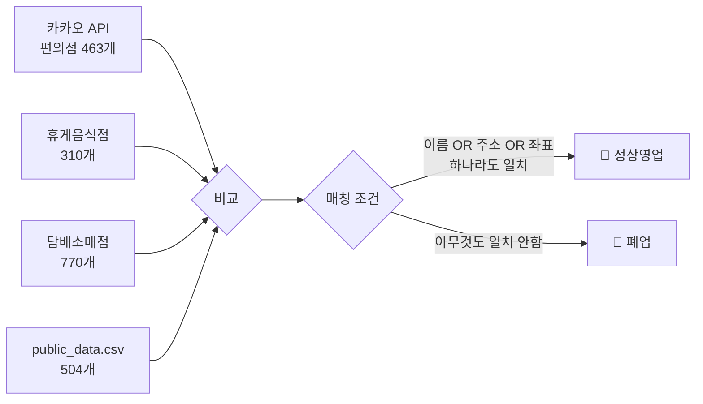

# 카카오맵 폐업 매장 체크 프로그램

카카오 API에서 수집된 편의점(463개)을 3개의 비교 데이터셋과 교차 비교하여 **정상 영업/폐업 상태**를 판별하고 카카오맵에 시각화하는 프로그램 개발

## 로직 요약



---

## Proposed Changes

### 1. Management Command

#### [NEW] [check_store_closure.py](file:///c:/A3_radius_collector-Public/stores/management/commands/check_store_closure.py)

새로운 Django management command 생성:

1. **데이터 로드**
   - `YeongdeungpoConvenience` 모델에서 카카오 API 편의점 463개 로드
   - `SeoulRestaurantLicense` 모델에서 휴게음식점(편의점 필터) 310개 로드
   - `TobaccoRetailLicense` 모델에서 담배소매점 770개 로드
   - `public_data.csv` 파일에서 소상공인상권 데이터 504개 로드

2. **정규화 함수** (기존 v2.3.3_cross_match_stores.py 참조)
   - `normalize_name()`: 이름 정규화 (공백/특수문자 제거, 소문자 변환)
   - `extract_road_address()`: 주소 정규화 (도로명 추출)
   - `round_coord()`: 좌표 반올림 (소수점 4자리)

3. **매칭 로직**
   - 카카오 API 각 편의점에 대해:
     - 이름이 3개 데이터 중 하나라도 존재하거나
     - 주소가 3개 데이터 중 하나라도 존재하거나  
     - 좌표가 3개 데이터 중 하나라도 존재하면 → **정상(파랑)**
     - 아무것도 일치하지 않으면 → **폐업(빨강)**

4. **결과 저장**: `store_closure_result.csv`

---

### 2. Map Template

#### [NEW] [store_closure_map.html](file:///c:/A3_radius_collector-Public/stores/templates/store_closure_map.html)

기존 `matched_stores_map.html` 참조하여 새 템플릿 생성:
- 제목: "카카오맵 폐업 매장 체크 프로그램[지도]"
- 마커 색상:
  - 🔴 **빨강**: 폐업 (카카오맵 업데이트 필요!)
  - 🔵 **파랑**: 정상

---

### 3. View & URL

#### [MODIFY] [views.py](file:///c:/A3_radius_collector-Public/stores/views.py)

새 뷰 함수 `store_closure_map_view()` 추가

#### [MODIFY] [urls.py](file:///c:/A3_radius_collector-Public/config/urls.py)

새 URL 패턴 추가: `store-closure/`

---

## Verification Plan

### 자동 테스트
```powershell
# 1. 커맨드 실행
docker compose exec web python manage.py check_store_closure

# 2. 결과 CSV 확인  
# store_closure_result.csv 파일 생성 확인
```

### 수동 테스트
1. Django 서버 실행: `docker compose up`
2. 브라우저에서 `http://localhost:8000/store-closure/` 접속
3. 지도에 파랑(정상)/빨강(폐업) 마커가 표시되는지 확인
