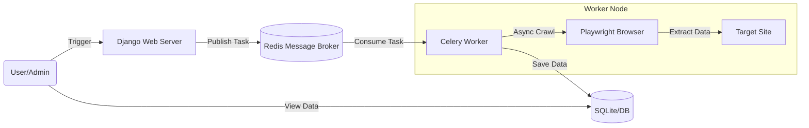

---

# 🛍️ Distributed E-commerce Data Pipeline

> **Django, Celery, Redis, Playwright를 활용한 고성능 비동기 분산 수집 시스템**

## 📖 프로젝트 개요 (Project Overview)

이 프로젝트는 대규모 이커머스 데이터 수집을 위해 설계된 **확장 가능한 데이터 파이프라인(Scalable Data Pipeline)**입니다.
단순한 동기식(Synchronous) 스크립트의 한계를 넘어, **비동기 작업 큐(Asynchronous Task Queue)** 시스템을 도입하여 수집 속도를 극대화하고 시스템의 안정성을 확보했습니다.

초기에는 상용 커머스(쿠팡, 무신사)를 타겟으로 Anti-Bot 우회 기술을 적용하였으며, 현재는 시스템 아키텍처 검증을 위해 `Books to Scrape` 샌드박스 환경에서 구동됩니다.

### 🎯 핵심 목표

1. **고성능 수집:** `asyncio`와 `Playwright`를 활용한 Non-blocking I/O 구현.
2. **확장성(Scalability):** `Celery`와 `Redis`를 도입하여, 수집 작업(Worker)을 여러 서버로 쉽게 확장 가능한 구조 설계.
3. **데이터 무결성:** Django ORM을 활용한 정규화된 데이터 스키마 설계 및 중복 방지 로직(`update_or_create`) 적용.
4. **관측 가능성(Observability):** Django Admin을 통한 데이터 적재 현황 실시간 모니터링.

---

## 🏗️ 시스템 아키텍처 (Architecture)

이 프로젝트는 **Producer-Consumer 패턴**을 따릅니다. Django 웹 서버가 작업을 발행(Producer)하고, Celery 워커가 이를 소비(Consumer)하여 처리합니다.



---

## 🛠️ 기술 스택 (Tech Stack)

| 구분 | 기술(Stack) | 선정 이유 |
| --- | --- | --- |
| **Backend** | **Django** | 강력한 ORM과 Admin 기능을 통해 데이터 모델링 및 관리가 용이함. |
| **Broker** | **Redis** | In-Memory 기반의 고속 메시지 브로커로, Celery와 가장 궁합이 좋은 백엔드. Docker로 컨테이너화하여 운영. |
| **Task Queue** | **Celery** | 무거운 크롤링 작업을 백그라운드로 격리하여 웹 서버의 부하를 방지하고 분산 처리를 가능하게 함. |
| **Crawler** | **Playwright** | Selenium 대비 빠른 속도, 안정적인 `async/await` 지원, 모던 웹(SPA) 렌더링 처리에 최적화됨. |
| **Infra** | **Docker** | Redis 등 인프라 의존성을 컨테이너로 관리하여 개발 환경의 일관성 유지. |

---

## 💡 주요 기능 및 구현 내용 (Key Features)

### 1. 비동기 작업 처리 (Asynchronous Task Processing)

* **문제:** 기존 동기식 크롤러는 응답을 기다리는 동안 CPU가 유휴 상태(Blocking)에 빠짐.
* **해결:** `Celery` + `asyncio`를 결합하여 단일 프로세스 내에서도 여러 페이지를 동시에 수집하도록 구현.

### 2. 안티 봇(Anti-Bot) 회피 전략 (Polite Crawling)

* **Human-like Behavior:**
* 랜덤 딜레이 (`Random Sleep`) 적용.
* `Mouse Wheel` 이벤트 시뮬레이션 및 비선형 스크롤링.


* **Session Management:**
* 주기적인 쿠키/캐시 삭제(Session Washing)로 탐지 회피.
* User-Agent 로테이션 적용 가능 구조.


### 3. 데이터 파이프라인 (ETL)

* **Extract:** HTML 구조 변경에 유연한 CSS/XPath Selector 전략 사용.
* **Transform:** 가격(`string` -> `int`), 평점(`text` -> `scale`) 데이터 정제.
* **Load:** Django ORM의 `update_or_create`를 사용하여 데이터 중복 저장 방지 및 최신성 유지.

### 4. 윈도우 환경 최적화 (Troubleshooting)

* **이슈:** Windows 환경에서 Celery 4.x 이상 버전이 `multiprocessing` 방식(`prefork`)과 충돌하여 프로세스가 멈추는 현상 발생.
* **해결:** `eventlet` 라이브러리를 사용하거나 실행 풀을 `-P solo` (단일 스레드 풀)로 설정하여 호환성 문제 해결.

---

## 📂 폴더 구조 (Project Structure)

```bash
Distributed-Crawler/
├── config/                 # 프로젝트 설정 (Settings, URL, WSGI)
│   ├── __init__.py         # Celery 앱 연결 설정
│   ├── celery.py           # Celery 설정 파일
│   └── settings.py         # INSTALLED_APPS, Redis 설정
├── crawler/                # 크롤링 앱
│   ├── tasks.py            # Celery 작업(Task) 정의 & Playwright 로직
│   ├── models.py           # 데이터베이스 모델 (Book)
│   └── admin.py            # 관리자 페이지 설정
├── sellers.db              # SQLite 데이터베이스
├── manage.py
└── README.md

```

---

## 🚀 실행 방법 (How to Run)

**Prerequisites**

* Python 3.10+
* Docker (for Redis)

### 1. 환경 설정 및 설치

```bash
# 가상환경 생성 및 활성화
python -m venv venv
source venv/bin/activate  # Windows: venv\Scripts\activate

# 패키지 설치
pip install django celery redis playwright django-celery-results eventlet
playwright install chromium

```

### 2. 인프라 실행 (Redis)

```bash
# Docker로 Redis 실행 (포트 6379)
docker run -d -p 6379:6379 --name my-redis redis

```

### 3. 서버 실행

**Terminal 1: Django Web Server**

```bash
python manage.py migrate
python manage.py runserver

```

**Terminal 2: Celery Worker (Windows)**

```bash
# Windows 환경에서는 solo 풀 사용 권장
celery -A config worker -l info -P solo

```

### 4. 크롤링 시작

**Terminal 3: Trigger Task**

```bash
python manage.py shell

```

```python
>>> from crawler.tasks import start_book_crawler
>>> start_book_crawler.delay()

```

---

## 📊 결과 확인

* **Django Admin:** `http://127.0.0.1:8000/admin/` 접속 후 `Books` 테이블 확인.
* **Console Log:** Celery 터미널에서 실시간 수집 로그 확인 가능.

---

## 📝 회고 (Retrospective)

초기에는 `requests`와 같은 단순 라이브러리로 접근했으나, 동적인 데이터 로딩과 차단 이슈에 직면했습니다. 이를 해결하기 위해 **Browser Automation(Playwright)**을 도입했고, 대량 수집 시 시스템 부하를 관리하기 위해 **Message Queue(Redis+Celery)** 아키텍처로 고도화했습니다. 이 과정을 통해 백엔드 엔지니어로서 **"단순 기능 구현"을 넘어 "시스템 설계"의 중요성**을 배웠습니다.